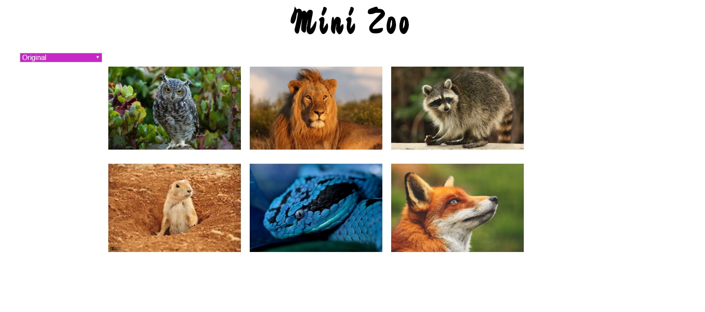

# Proyecto: Mini zoo

## Descripción del Proyecto:

El siguiente repositorio contiene el desarrollo del proyecto Mini zoo, que consiste en cambiar el filtro (Blanco y negro, sepia, invertir colores y original) de las imágenes a través de la aplicación de estilos con CSS3 y la funcionalidad de eventos con Javascript.

## Herramientas utilizadas:

1. HTML5

2. CSS3

4. JS

## Pseudocódigo:

1. FUNCION load()
2. Definir image = document.getElementsByClassName('animal');
3. Definir select = document.getElementById('select');
4. FUNCION changeFilter(event) 
5. PARA var i = 0; i < image.length; i++)
6. SI select.value === 'original' ENTONCES
~~~
7. image[i].classList.remove('black-white');
8. image[i].classList.remove('invert');
9. Imprimir image[i].classList.remove('sepia');
~~~

10. FIN SI
11. ADEMÁS SI select.value === 'sepia'
~~~    
12. image[i].classList.remove('black-white');
13. image[i].classList.remove('invert');
14. Imprimir image[i].classList.add('sepia');
~~~
15. FIN ADEMAS SI
16. ADEMAS SI else if (select.value === 'white-black') {
~~~
17.  image[i].classList.remove('invert');
18.  image[i].classList.remove('sepia');
19.  Imprimir image[i].classList.add('black-white');
~~~
20. FIN ADEMAS SI
21. ADEMAS SI select.value === 'negative-colors'
~~~        
22. image[i].classList.remove('black-white');
23. image[i].classList.remove('sepia');
24. Imprimir image[i].classList.add('invert');
~~~ 
25. FIN ADEMAS SI
26. FIN PARA
27. FIN FUNCION  changeFilter     
28. FIN FUNCION  load

## Diagrama de Flujo
https://go.gliffy.com/go/share/image/sj82mxf2cjpf6elmyjgr.png?utm_medium=live-embed&utm_source=custom